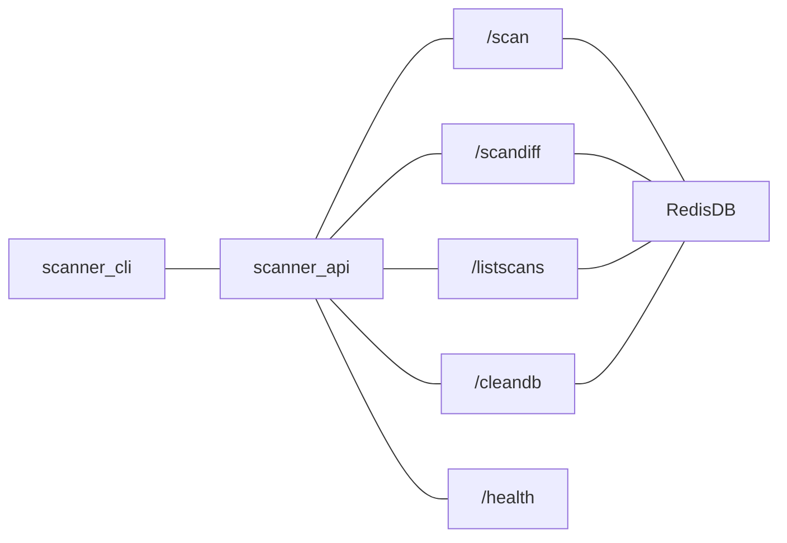

# Network Scanner API
Network scanner API is based on nmap library recreated as microservice with redis support

## Endpoint diagram


## Usage of server with REST API
Server is REST API server with simple interface where you can call HTTP GET on various endpoints.  
### Table of Endpoints
|Endpoint|Description|
|--------|-----------|
|`/scan?ip=IP_ADRESS_RANGE` or `/scan?ip=IP_ADRESS`|simple scan with Redis storage|
|`/scandiff?ip=IP_ADRESS_RANGE` or `/scandiff?ip=IP_ADRESS`|scan with diff with previous scan|
|`/listscans`|list all IP keys of scans stored in DB|
|`/cleandb`|clean database of scanned IPs|
|`/health`|check if service is running|

### Start standalone server
To start server simply run:  
`make server`

### Get scan data from standalone server
You can get scanned data with:  
`curl http://127.0.0.1:8000/scan\?ip\=192.168.1.1`

#### Scan result
Result should looks like:  
```json
"[{\"hostnames\": [{\"name\": \"\", \"type\": \"\"}], \"addresses\": {\"ipv4\": \"192.168.1.1\"}, \"vendor\": {}, \"status\": {\"state\": \"up\", \"reason\": \"syn-ack\"}, \"tcp\": {\"80\": {\"state\": \"open\", \"reason\": \"syn-ack\", \"name\": \"http\", \"product\": \"\", \"version\": \"\", \"extrainfo\": \"\", \"conf\": \"3\", \"cpe\": \"\"}}}]"
```

## Redis support
You have to run Redis instance on your local to launch `scanner-api.py` with `make server`
You can install redis with command:
```shell
apt install redis
```

You can reconfigure scanner-api with env variables to follow to other Redis instance.
Environment variables: 
```shell 
REDIS_HOST
REDIS_PORT
REDIS_DB
```

## Batch run
Check directory scanner-batch for more information.

## Work with Makefile
You can easily deploy script with docker just with `make` utility.  
Command:  
    `make build` - build new docker  
    `make push` - push docker image to public dockerhub  
    `make deploy` - deploy to microk8s  
    `make server` - start scanner api server on [localhost:8000](`http://127.0.0.1:8000`)  
    `make test` - run with docker  
    `make clean` - clean image from docker repository  
    `make all` - all above  
